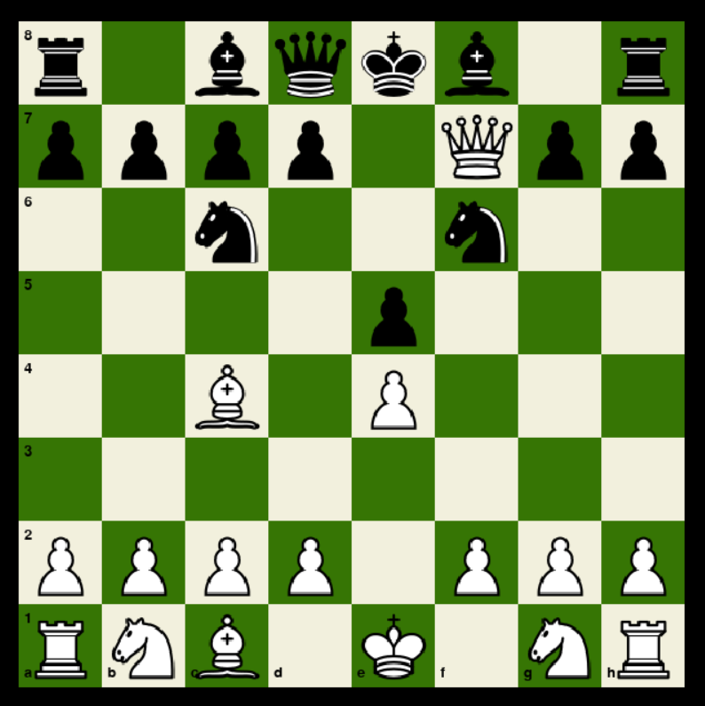
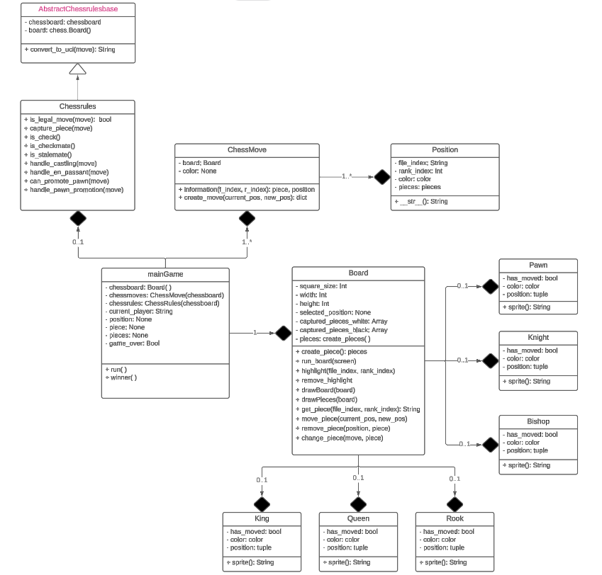

# Chess-Game

[]()
[](https://opensource.org/licenses/MIT)
[](https://www.python.org/downloads/)
[](https://www.pygame.org/news)
[](https://python-chess.readthedocs.io/en/latest/)
[]()

This project is a chessgame program written in python. The games tracking is done though the command line interface. The game can be played with 2 players.
```bash
  git clone https://github.com/Xander172006/Chess-Game.git
```
Once the project has been cloned, you need to install the dependencies and following libraries that can be seen in the **Installation** section below.

## Installation
The following libraries are required to run the application:
- [Python](https://docs.python.org/3/) served as the primair programming language
- [Pygame](https://www.pygame.org/docs/ref/pygame.html) to visualize the board and pieces
- [Python-chess](https://python-chess.readthedocs.io/en/latest/) for handling gamerules and move validations.
<br>

Ensure that you download the most recent version of these libraries.

### a. Pygame
Install [`pygame`](https://www.pygame.org/docs/ref/pygame.html) using the following command:
```bash
  pip install pygame
```

### b. Pyhton-chess
Install [`python chess`](https://python-chess.readthedocs.io/en/latest/) using the following command:
```bash
  pip install python-chess
```

## Usage
### Generating the board
Make sure you are in the correct directory and run the following command:
```bash
  cd path/to/Chess-Game
  python maingame.py
```

Once it has been loaded in, you can start making interactions with the pieces on the board.
When interacting with a piece, that piece will be highlighted for better player management.
<br>

[](./docs/screenshots/chessboard.png)

The commandline will keep track of the current game details. It will also display moves that are made by the players.
Finally, when the game is over the application will close with the results of the game.


## Implementations & customizing

[](./docs/screenshots/chessgame_class_diagram.png)
</br>

If curious about the implementation of the game, you can find the UML diagram above.
The diagram shows the classes that are required for this game project.


For more information about the game of chess, you can go to either **[chess.com](https://chess.com)** or check out the offical **[chess wikipedia](https://en.wikipedia.org/wiki/Chess)** page.
<br>

## Contributors


[](Xander172006)

**Location:** Bit Academy, Amsterdam
</br>
**Email:** xanderpoggenklaas@gmail.com
</br>
**Twitter:** [@XPoggenklaas](https://twitter.com/XPoggenklaas)